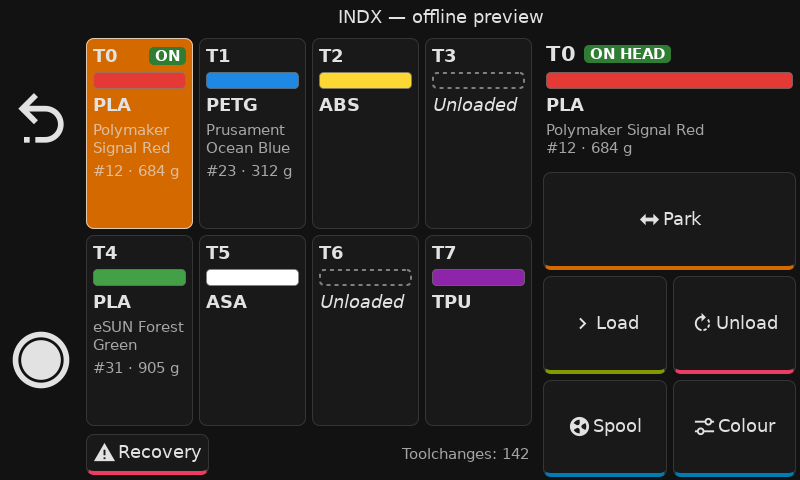
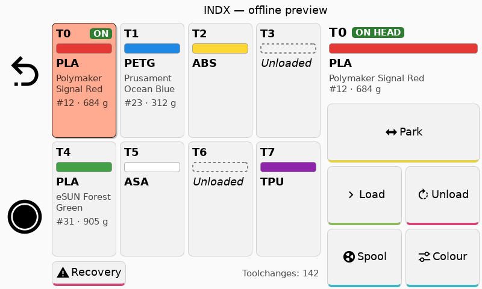
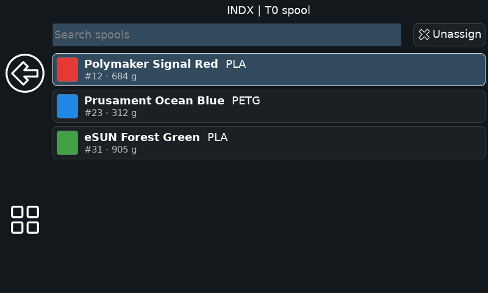
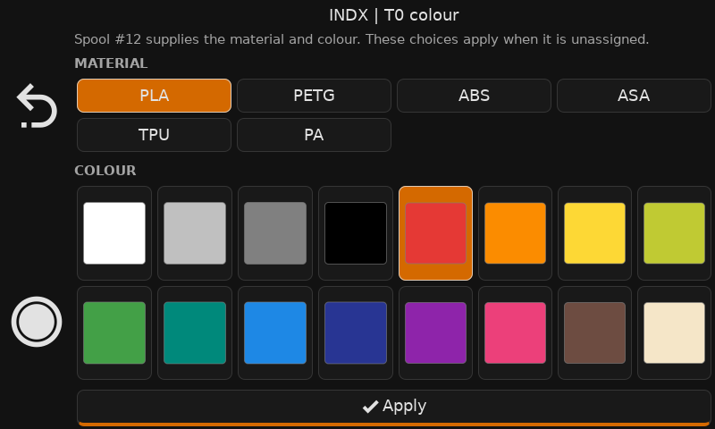
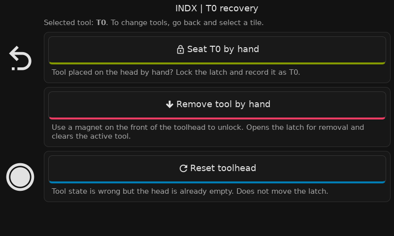

# INDX KlipperScreen add-on

A tool panel for the Bondtech INDX toolchanger. See up to eight tools at a
glance, then pick up, park, load, unload, or change a tool's spool and colour.
It runs as an add-on to stock KlipperScreen.



*Offline preview with mock printer and Spoolman data. The surrounding title
and navigation are a preview shell; your KlipperScreen theme may look different.*

### More screens

| Light theme | Spool picker |
| --- | --- |
| [](docs/screenshots/tool-overview-light.png) | [](docs/screenshots/spool-picker.png) |
| **Material and colour** | **Recovery** |
| [](docs/screenshots/colour-picker.png) | [](docs/screenshots/recovery.png) |

- Each tool tile shows its material, colour, and assigned Spoolman spool
  (name, ID, remaining weight). **ON** marks the mounted tool.
- Select a tile for Pick up/Park, Load, Unload, Spool, and Colour. A completed
  load opens the spool picker, or the colour picker when Spoolman is absent.
- Recovery offers manual seat, remove, and toolhead reset actions. They run
  immediately when tapped; manual removal needs a magnet at the toolhead.
- The panel is view only during a print. Actions remain available while paused.

## Requirements

- KlipperScreen with add-on support: commit `8abe645c` (PR #1770,
  2026-09-13) or newer. `install.sh` checks.
- The INDX macros from [mathewdunne/INDX](https://github.com/mathewdunne/INDX)
  (`indx/*.cfg`), not upstream Bondtech: the macros the panel runs live
  there. `[save_variables]` and `[respond]`, as INDX already requires.
- Optional: Moonraker's `[spoolman]` component, for spool assignment.

## Install on the printer

```bash
cd ~ && git clone https://github.com/mathewdunne/INDX-KlipperScreen-Add-On.git
~/INDX-KlipperScreen-Add-On/install.sh
```

The installer symlinks the panel, the add-on, the menu icon and the menu
conf into place, adds `[include indx_menu.conf]` and `enable_addons: True`
to `KlipperScreen.conf`, and hides its files from KlipperScreen's
`git status`. It never edits `printer.cfg`. Then restart KlipperScreen:

```bash
sudo systemctl restart KlipperScreen
```

The INDX button appears on the main menu and the print menu.

After updating an existing installation, rerun `install.sh` once to update
the theme icons, then restart KlipperScreen.

For macros, saved variables, and button overrides, see the
[configuration reference](docs/configuration.md).

## Local UI preview

Render your own screenshots or open a clickable GTK preview with mock data.
See [preview setup and usage](tools/preview.md).

## Updates with Moonraker

Add to `moonraker.conf`:

```
[update_manager indx_klipperscreen]
type: git_repo
path: ~/INDX-KlipperScreen-Add-On
origin: https://github.com/mathewdunne/INDX-KlipperScreen-Add-On.git
primary_branch: main
managed_services: KlipperScreen klipper
```

## Uninstall

```bash
~/INDX-KlipperScreen-Add-On/install.sh -u
```

## License

GPLv3. See `LICENSE`.
