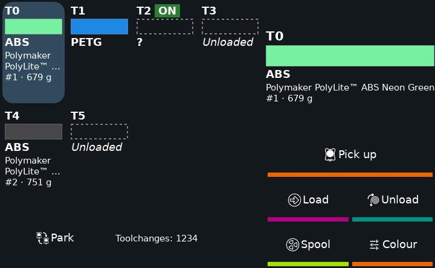

# INDX KlipperScreen add-on

A KlipperScreen panel for the Bondtech INDX toolchanger: every tool at a
glance, and pick up, park, load, unload, Spoolman spool and colour per tool.
Out of tree: stock KlipperScreen, no fork.



- Up to 8 tools, count read from `gcode_macro TOOL_POSITIONS.tool_count`.
- Each tile shows the filament colour and material, and the Spoolman spool
  (name, ID, remaining weight) when one is assigned. The mounted tool
  carries an **ON** badge.
- The selected tool's actions: Pick up, Load, Unload, Spool, Colour. Park
  and the toolchange count sit under the grid.
- View only while printing; everything works while paused.

## Requirements

- KlipperScreen with add-on support: commit `8abe645c` (PR #1770,
  2026-09-13) or newer. `install.sh` checks.
- Bondtech INDX macros (`indx/*.cfg`), with `[save_variables]` and
  `[respond]` as INDX already requires.
- Optional: Moonraker's `[spoolman]` component, for spool assignment.

## Install

```bash
cd ~ && git clone https://github.com/mathewdunne/INDX-KlipperScreen-Add-On.git
```
```bash
~/INDX-KlipperScreen-Add-On/install.sh
```

The installer symlinks the panel, the add-on, the menu icon, the menu conf
and the companion macros into place, adds `[include indx_menu.conf]` and
`enable_addons: True` to `KlipperScreen.conf`, and hides its files from
KlipperScreen's `git status`. It never edits `printer.cfg`. Then:

1. Add the companion macros to `printer.cfg`, **after** the INDX includes,
   and restart Klipper:

   ```
   [include indx_companion.cfg]
   ```

2. Restart KlipperScreen:

   ```bash
   sudo systemctl restart KlipperScreen
   ```

The INDX button appears on the main menu and the print menu.

### Mainsail per-tool spools (optional)

Mainsail's Change Spool dialog lists a tool only when its `T<n>` macro
declares a `spool_id` variable. Add one to each of your tools:

```
[gcode_macro T0]
variable_spool_id: None
gcode: CHANGE_TOOL TOOL=0
```

The panel and Mainsail then read and write the same assignment
(`t<n>__spool_id` in `save_variables`), so either UI can assign spools.

### Active spool follows the mounted tool

Moonraker only tracks usage for one active spool. For it to follow
toolchanges, the INDX macros call `_INDX_TOOLCHANGE_SPOOL`. Upstream INDX
does not do this yet; until it does, add the call at the end of
`_RECORD_TOOLCHANGE` in `indx-tc-macros.cfg`:

```
    
        _INDX_TOOLCHANGE_SPOOL TOOL={t}
    
```

and after `SAVE_VARIABLE VARIABLE=active_tool VALUE=-1` in
`_PARK_TOOL_APPLY`:

```
        
            _INDX_TOOLCHANGE_SPOOL TOOL=-1
        
```

Without it everything else works; the active spool just stays where it was.

## What the companion macros do

`indx_companion.cfg` holds the Klipper side. The panel only sends G-code;
Klipper owns the data.

| Macro | |
|---|---|
| `UNLOAD_FILAMENT TOOL= [TEMP=]` | Ram and retract 85 mm (Prusa Core ONE sequence plus 30 mm). Also forgets the tool's material, colour and spool |
| `INDX_SET_SPOOL TOOL= SPOOL=` | Assign a Spoolman spool, `SPOOL=0` to unassign. Updates the active spool if the tool is mounted |
| `INDX_SET_FILAMENT TOOL= [MATERIAL=] [COLOR=]` | Material and colour by hand, shown when no spool is assigned |
| `INDX_LOAD`, `INDX_UNLOAD`, `INDX_TOGGLE TOOL=` | Tool and material pickers as Klipper prompts; work in Mainsail too |
| `_INDX_LOAD_PICK TOOL=` | The panel's Load: asks for the material, runs `LOAD_FILAMENT`, records the material |
| `_INDX_TOOLCHANGE_SPOOL TOOL=` | Hook for the toolchange macros, see above |

Per-tool state lives in `save_variables`: `t<n>_fil_density` (set by
`LOAD_FILAMENT`; loaded when not null), `t<n>_fil_type`, `t<n>_fil_color`,
`t<n>__spool_id`. An assigned spool's colour and material win over the
hand-set ones, which show again once the spool is unassigned.

Only the panel's Load records the material. `LOAD_FILAMENT` typed at the
console loads fine, and the tile shows `?` until you set the material with
Colour.

If you already define any of these macros elsewhere, the file included last
wins option by option. Remove your old copies.

## Changing the buttons

Every button runs a Moonraker method with parameters, `printer.gcode.script`
by default. Override one in `KlipperScreen.conf` with a `[menu indx <action>]`
section; options you leave out keep their defaults. The actions are
`pickup`, `load`, `unload`, `spool`, `filament` and `park`. In `params` the
panel replaces `{tool}`, `{spool}`, `{material}` and `{color}`:

```
[menu indx unload]
params: {"script": "MY_UNLOAD TOOL={tool}"}
```

All defaults are listed in `klipperscreen/indx_menu.conf`. Do not edit that
file itself: it is a symlink into this repo, and local edits block updates.

## Updates with Moonraker

Add to `moonraker.conf`:

```
[update_manager indx_klipperscreen]
type: git_repo
path: ~/INDX-KlipperScreen-Add-On
origin: https://github.com/mathewdunne/INDX-KlipperScreen-Add-On.git
primary_branch: main
managed_services: KlipperScreen klipper
```

## Uninstall

Remove `[include indx_companion.cfg]` from `printer.cfg` and restart
Klipper first (the installer refuses otherwise), then:

```bash
~/INDX-KlipperScreen-Add-On/install.sh -u
```

## License

GPLv3. See `LICENSE`.
