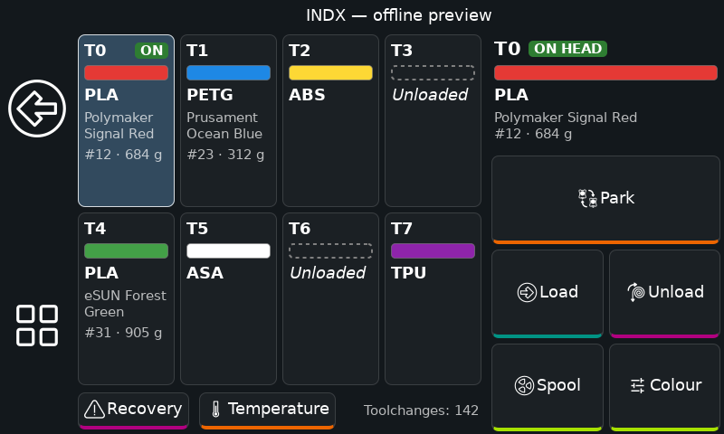
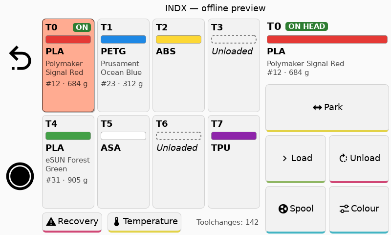
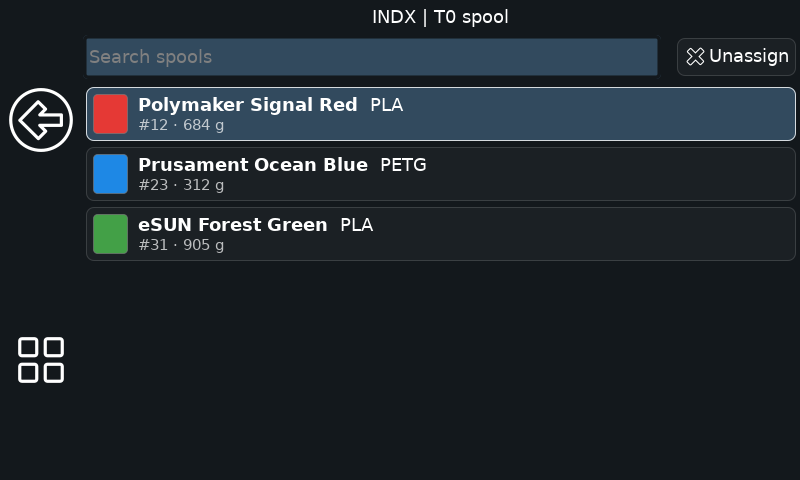
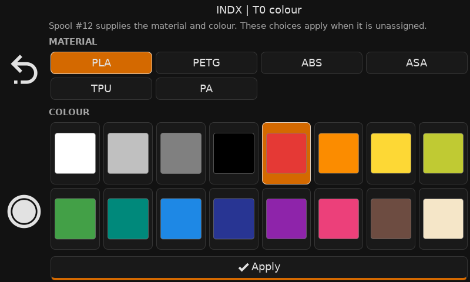
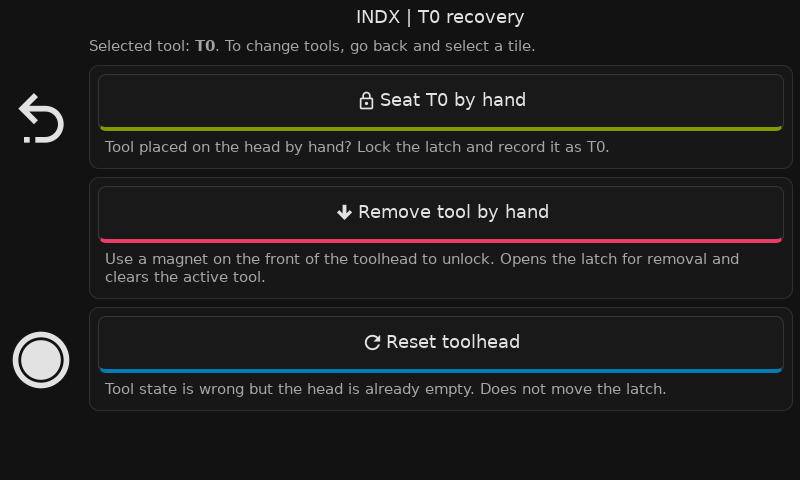

# INDX KlipperScreen add-on

A touchscreen panel for the Bondtech INDX toolchanger, built as an add-on for
KlipperScreen. It shows every tool at a glance (up to eight), and lets you pick
up, park, load, unload, and set a tool's spool and colour without opening
Mainsail.



*Offline preview with mock printer and Spoolman data. The surrounding title
and navigation are a preview shell; your KlipperScreen theme may look different.*

## What it does

| Light theme | Spool picker |
| --- | --- |
| [](docs/screenshots/tool-overview-light.png) | [](docs/screenshots/spool-picker.png) |
| **Material and colour** | **Recovery** |
| [](docs/screenshots/colour-picker.png) | [](docs/screenshots/recovery.png) |

- **Tool tiles.** Each tile shows the tool's material, colour, and assigned
  Spoolman spool (name, ID, remaining weight). **ON** marks the tool that is
  mounted right now.
- **Per-tool actions.** Tap a tile for Pick up or Park, Load, Unload, Spool, and
  Colour. When a load finishes, the spool picker opens on its own (or the colour
  picker, if you don't use Spoolman).
- **Recovery.** For when a tool ends up somewhere it shouldn't be: seat it, remove
  it, or reset the toolhead by hand. These run the moment you tap them, and
  manual removal needs a magnet at the toolhead.
- **Temperature.** One tap opens the stock Temperature panel, and Back returns
  you to INDX.
- **During a print** the panel is view only. Actions come back while paused.

There are no confirmation dialogs, so a tap does what it says. That was a
deliberate choice, but worth knowing before you tap Unload on the wrong tile.

## Before you install

The panel just sends G-code, so it needs macros on the printer to call. Which
ones depends on your setup:

- **Starting fresh, or happy to switch:** use
  [mathewdunne/INDX](https://github.com/mathewdunne/INDX). It is a fork of
  Bondtech's macros with the extra helpers this panel uses (spool, material,
  colour, load flow, and manual seat). The panel's button defaults are written
  for it, so everything works with no further setup. The defaults do **not**
  work with unmodified upstream Bondtech macros.
- **Already have INDX macros you like:** keep them. Point any panel button at
  your own macro names by overriding it in `KlipperScreen.conf`. The
  [configuration reference](docs/configuration.md) lists every button, its
  default G-code, the placeholders you can use, and a copy-and-edit example. It
  also explains which printer state the tool tiles read, so you can keep it
  compatible.

## Requirements

- **KlipperScreen v0.4.7-184 or newer**, the version Mainsail's update panel
  shows. That build added add-on loading (PR #1770, commit `8abe645c`,
  2026-09-13); the tagged `v0.4.7` release is too old. `install.sh` checks
  for you.
- **INDX macros**, as described above. The panel reads tool data from Klipper's
  `[save_variables]`, and the fork also needs `[respond]`. If you use your own
  macros, they need to maintain compatible state for the tiles to fill in.
- **Optional:** Moonraker's `[spoolman]` component, for assigning spools.

## Install

On the printer (over SSH):

```bash
cd ~ && git clone https://github.com/mathewdunne/INDX-KlipperScreen-Add-On.git
~/INDX-KlipperScreen-Add-On/install.sh
```

The installer symlinks the panel, the add-on, the menu icon and the menu conf
into place, adds `[include indx_menu.conf]` and `enable_addons: True` to
`KlipperScreen.conf`, and hides its files from KlipperScreen's `git status`. It
never touches `printer.cfg`. Then restart KlipperScreen:

```bash
sudo systemctl restart KlipperScreen
```

The INDX button appears on the main menu and the print menu. If you kept your
own macros, set up the button overrides before you use the panel:
[configuration reference](docs/configuration.md).

## Updating

With Moonraker's update manager, add this to `moonraker.conf`:

```
[update_manager indx_klipperscreen]
type: git_repo
path: ~/INDX-KlipperScreen-Add-On
origin: https://github.com/mathewdunne/INDX-KlipperScreen-Add-On.git
primary_branch: main
managed_services: KlipperScreen
```

The update manager only pulls. If a release note says to rerun `install.sh`,
run it once after updating.

Or by hand: pull, rerun the installer to refresh the links and icons, and
restart KlipperScreen.

```bash
cd ~/INDX-KlipperScreen-Add-On
git pull
./install.sh
sudo systemctl restart KlipperScreen
```

## Uninstall

```bash
~/INDX-KlipperScreen-Add-On/install.sh -u
```

## Tweaking the UI

You can render your own screenshots or open a clickable GTK preview with mock
data, no printer needed. See [preview setup and usage](tools/preview.md).

## Feedback

Bug reports, ideas, and pull requests are welcome; open an issue on GitHub. If
you're on the Bondtech Discord, you'll find me in the INDX channels too.

## License

GPLv3. See `LICENSE`.
